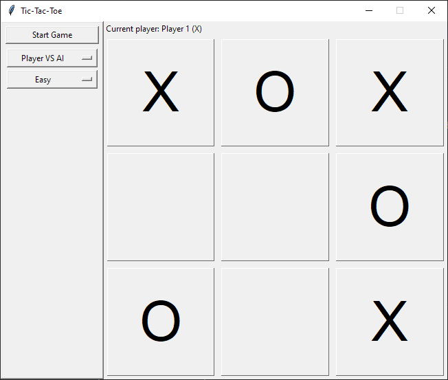
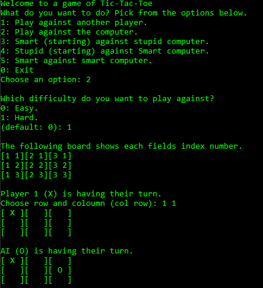

# Tic-Tac-Toe

Tic-Tac-Toe is my try at the classic game, programmed in python.

## Usage

The game has two different modes for playing, text and gui.

As default, the gui version will start when writing:

```
python game.py
```



To start the text version, write the following in a commando promp:

```
python game.py -m cmd
```


